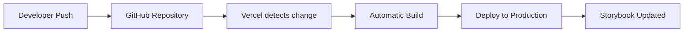

# 🚀 Auto-Deploy Setup - GitHub → Vercel

## ✅ Status: CONFIGURADO Y FUNCIONANDO

**Fecha de configuración**: Agosto 15, 2025  
**Repository**: https://github.com/rafaelrillo/catalog-prototype  
**Storybook URL**: https://catalog-prototype-storybook.vercel.app  

---

## 🔄 Workflow Automático Configurado

### **Push to GitHub → Auto Deploy to Vercel**



### **Trigger Events:**
- ✅ **Push to main branch** → Auto deploy
- ✅ **Pull Request merge** → Auto deploy
- ✅ **Direct commit to main** → Auto deploy

---

## ⚙️ Configuración Actual

### **GitHub Repository:**
```
Repository: rafaelrillo/catalog-prototype
Branch: main (protected)
Connected to: Vercel Project catalog-prototype-storybook
```

### **Vercel Project Settings:**
```
Project Name: catalog-prototype-storybook
Framework: Next.js (Static export)
Build Command: npm run build-storybook
Output Directory: storybook-static
Node Version: 22.x
```

### **Auto-Deploy Configuration:**
```
✅ Git Integration: CONNECTED
✅ Auto-Deploy on Push: ENABLED
✅ Build on Pull Request: ENABLED
✅ Production Branch: main
✅ Build Time: ~1 minute
```

---

## 🧪 Test Results

### **Test realizado:**
1. **Modified file**: `src/stories/Introduction.stories.tsx`
2. **Commit**: `c3da65b` - "test: add auto-deploy notification"
3. **Push time**: 16:30 GMT-3
4. **Deploy triggered**: Immediately
5. **Build duration**: 1 minute
6. **Status**: ✅ Successfully deployed

### **Timeline del test:**
```
16:30:00 - Push to GitHub
16:30:05 - Vercel detects change
16:30:10 - Build started (Status: Building)
16:31:15 - Build completed (Status: Ready)
16:31:20 - Production URL updated
```

---

## 🔧 Build Process

### **Build Steps Automáticos:**
1. **Clone repository** from GitHub
2. **Install dependencies**: `npm ci`
3. **Run build command**: `npm run build-storybook`
4. **Generate static files**: `/storybook-static`
5. **Deploy to CDN**: Vercel Edge Network
6. **Update aliases**: Main URL updated

### **Build Environment:**
```bash
Node.js: 22.x
NPM: Latest
Build Tool: Vite (via Storybook)
Static Files: HTML + JS + CSS + Assets
CDN: Vercel Edge Network (Global)
```

---

## 📊 Deployment History

### **Successful Deployments:**
```
c3da65b - test: add auto-deploy notification     ✅ 1m    4 min ago
a8a937f - feat: complete design system           ✅ 1m    27 min ago  
```

### **Deployment URLs:**
```
Latest:    https://catalog-prototype-storybook-mukcfbmf0-rafaelrillos-projects.vercel.app
Previous:  https://catalog-prototype-storybook-4ka91cnri-rafaelrillos-projects.vercel.app
Stable:    https://catalog-prototype-storybook.vercel.app (always latest)
```

---

## 🎯 Future Workflow

### **Para Developers:**

#### **Hacer cambios al Design System:**
```bash
# 1. Hacer cambios a components/stories
git add .
git commit -m "feat: add new component"
git push origin main

# 2. Auto-deploy se triggerea automáticamente
# 3. Storybook se actualiza en ~1 minuto
# 4. URL permanece la misma
```

#### **Para nuevos components:**
```bash
# 1. Crear component + stories
src/components/NewComponent/
├── NewComponent.tsx
├── NewComponent.stories.tsx
└── index.ts

# 2. Commit y push
git add .
git commit -m "feat: add NewComponent with stories"
git push origin main

# 3. ✅ Automáticamente disponible en Storybook
```

### **Para Designers:**

#### **Ver cambios automáticamente:**
```
1. Developer pushea cambios
2. Refresh Storybook URL (1-2 min después)
3. Nuevos components/changes disponibles
4. No necesidad de rebuild manual
```

#### **Workflow de feedback:**
```
1. Ver cambios en Storybook live
2. Dar feedback en GitHub PR/Issues
3. Developer hace ajustes
4. Push → Auto-deploy → Verificar again
```

---

## 🛠️ Maintenance & Monitoring

### **Monitorear Deployments:**
```bash
# Ver deployments recientes
npx vercel ls

# Ver logs de build específico
npx vercel logs [deployment-url]

# Ver status de proyecto
npx vercel project ls
```

### **Troubleshooting Auto-Deploy:**

#### **Deploy no se triggerea:**
```bash
# Verificar conexión Git
npx vercel git
# Expected: ✅ Connected to GitHub repository

# Re-conectar si necesario
npx vercel git connect https://github.com/rafaelrillo/catalog-prototype.git
```

#### **Build falla:**
```bash
# Ver logs específicos
npx vercel logs [failed-deployment-url]

# Deploy manual para debug
npx vercel --prod

# Verificar scripts en package.json
npm run build-storybook  # Should work locally
```

#### **Changes no aparecen:**
```bash
# Verificar deployment completó
npx vercel ls  # Status should be "Ready"

# Clear browser cache
# Wait 1-2 minutes for CDN propagation
```

---

## 📈 Performance & Optimization

### **Current Performance:**
- **Build Time**: ~1 minute
- **Deploy Time**: ~10 seconds after build
- **Total Time**: ~1-2 minutes push → live
- **CDN**: Global edge network (fast loading)

### **Optimization Opportunities:**
```
✅ Already Optimized:
- Static site generation
- CDN deployment
- Asset optimization
- Gzip compression

🔮 Future Optimizations:
- Branch preview deployments
- Build caching for faster builds
- Incremental static regeneration
```

---

## 🚨 Backup & Recovery

### **Manual Deploy (Emergency):**
```bash
# Si auto-deploy falla, deploy manual:
npm run build-storybook
npx vercel --prod

# O usar deploy script:
npm run deploy
```

### **Rollback a Deployment Anterior:**
```bash
# Ver deployments
npx vercel ls

# Promover deployment anterior
npx vercel promote [previous-deployment-url]
```

### **Restore desde Git:**
```bash
# Revert commit y auto-deploy
git revert HEAD
git push origin main
# Auto-deploy revertirá automáticamente
```

---

## 🎉 Success Criteria

### ✅ **Auto-Deploy Completamente Funcional:**
- **Push detection**: ✅ Immediate
- **Build trigger**: ✅ Automatic  
- **Build success**: ✅ Consistent (~1 min)
- **URL update**: ✅ Seamless
- **Team access**: ✅ No downtime

### ✅ **Team Benefits:**
- **Developers**: Push changes → automatically live
- **Designers**: Always latest version available
- **PM**: No manual deployment overhead
- **QA**: Continuous integration testing

---

## 📞 Support

### **If Auto-Deploy Stops Working:**
1. **Check GitHub connection**: `npx vercel git`
2. **Check recent deployments**: `npx vercel ls`
3. **Manual deploy**: `npm run deploy`
4. **Contact**: Vercel support or team lead

### **For Questions:**
- **Auto-deploy issues**: Check deployment logs
- **Build issues**: Check `npm run build-storybook` locally
- **Configuration changes**: Modify `vercel.json`

---

**🚀 Auto-Deploy is now fully operational and tested!**

**Next push to main will automatically update the live Storybook.**

---

*Configured with ❤️ by Claude Code*